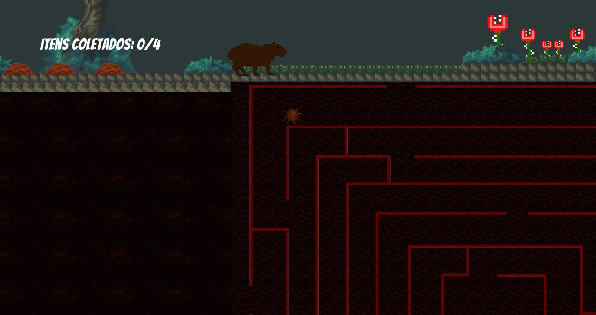

 <h1 align = center> Ciclo da Vida </h1>
 
 
 
 <h2 align = center>O ciclo da vida foi um jogo desenvolvido especialmente para a GameJam do Canal CSJ com o tema de loop infinito.</h2>

 <h3 align = center> Infinity Loop GameJam 01/05 a 09/05/2021 </h1>
 
 Após a divulgação do tema, o primeiro passo foi fazer um planejamento(GDD básico) para facilitar a visualização do projeto.
 
 

 

 Com o planejamento feito, realizei um prótótipo na Unity, buscando visualizar e  viabilizar o projeto. Foram utilizados objetos primitivos
 como quadrados, círculos e outras figuras para realizar as atividades pensadas no projeto. 
 
 Ao perceber que o projeto poderia ser realizado comecei
 a pesquisar sobre os animais que iriam compor o jogo, assim como seus comportamentos. 
 
 

                                              
  
 

 
 Logo em seguinda realizei as artes em pixelArt utilizando o PISKEL.
 
 

                                              
  
                                              
  
  
  
  
 

 
 Com os códigos funcionando corretamente e com as imagens prontas, utilizei o TileMap da unity com assets da UnityAssetsStore
 para criar o cenário, utilizei as ferramentas de  animação da unity para dar vida aos objetos, e logo em seguida comecei as 
 buscas pelas músicas e efeitos sonoros do jogo. Utilizei o editor de Audio "Audacity" para criar os efeitos desejados em cada som.
 

                                              
  
 

 
 Logo em seguida criei o Menu utilizando a UI da unity, a imagem com a logo foi desenvolvida no Adobe Illustrator.
 
 Meu jogo foi selecionado entre os 50 melhores dentre mais de 100 jogos publicados na GameJam. No vídeo abaixo do Canal CSJ no tempo 1:19:00 os 
 avaliadores fizeram um review do meu jogo. https://www.youtube.com/watch?v=B7dhdllB85Y&t=4688s
 
 

                                              
  
  
 

 
 
 Foi uma semana de bastante trabalho, mas muito contente com o resultado final. https://play.unity.com/mg/other/build-2nr este é o link para jogar online e
 https://gamejolt.com/games/dfam92/614993
 este é o link para o dwonloadjogo.
 
 It Was a week of hard work but was very rewarding too. The final result was great for me because it was my first public game.
 https://gamejolt.com/games/dfam92/614993
 the link above its the game.
 
